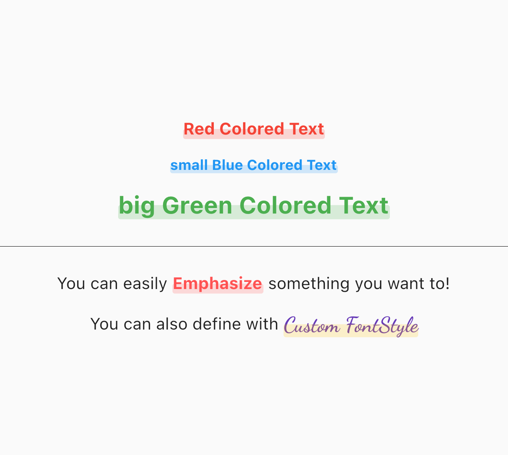

# Colored Text

Flutter Package for easily express **fancy Highlighted Text**

it looks like the text marked with a **highlighter pen**




## Features

- this package automatically calculate the size of your text
- you can define *color*, *fontSize*, and *textStyle*

|Parameter|Data type|Action|
|:-|:-|-:|
|color|Color|color of Text and Highlighter|
|fontSize|double|define your textSize (optional)|
|textStyle|TextStyle|define with Custom TextStyle (optional)|


## Getting Started

1. Add the latest version of package to your pubspec.yaml (and run `flutter pub get`)
   
```dart
dependencies:
    colored_text: ^0.0.1
```

2. Import the package and use it in your Flutter App.

```dart
import 'package:colored_text/colored_text.dart';
```


## Usage

Basic ColoredText
```dart
ColoredText('Red Colored Text', color: Colors.red)
```

ColoredText with custom fontSize
```dart
ColoredText('small Blue Colored Text', color: Colors.blue, fontSize: 12)
```

```dart
ColoredText('big Green Colored Text', color: Colors.green, fontSize:20)
```

ColoredText with Custom TextStyle
```dart
ColoredText(
  'Custom FontStyle',
  color: Colors.amber,
  textStyle: GoogleFonts.dancingScript(
    fontWeight: FontWeight.bold,
    fontSize: 18,
    color: Colors.deepPurple,
  ),
)
```

## Feature request and bugs

Please file feature requests and bugs at this [Issue Tracker](https://github.com/seunghyun-bloom/colored_text/issues)

---

#### Thank you for your interest

Seunghyun Kwon